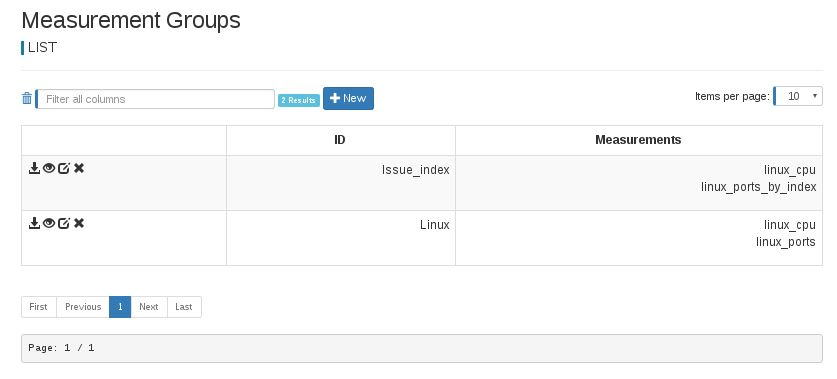
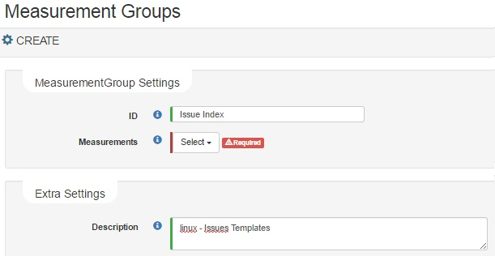

## View

Configured **Measurement Groups** are shown as table. This will appear every time you navigate from menu.

## Add/Edit InfluxDB output databases

- **Add**: In the InfluxDB Servers list click on new button 

- **Edit**: Click on InfluxDB edit's button 

The Create/Modify form will show up:

### Configuration Parameters

Type of settings|Config Parameter| Description
----------------|-----------------|-----------------
MeasurementGroups settings|ID| Text String that uniquely identify the measurement group recommended use the Product/Device Name/model as, should be unique in the database
||Measurements| A list of measurement id's
Extra settings|Description| A description text for the  measurement group.

### Multi edit in Measurement Groups

Multi edit has 1 option: Remove

1. Remove: Allows to remove all the selected items