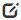
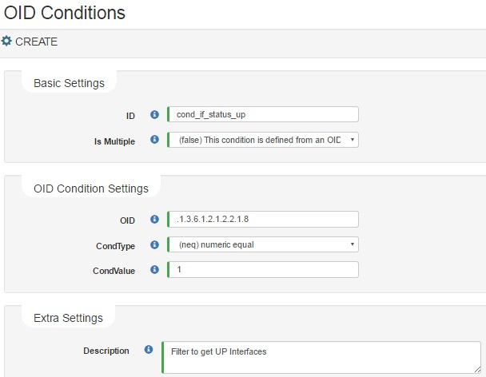

## View

Configured **OID Conditions** are shown as table. This will appear every time you navigate from menu.



## Add/Edit OID Conditions

- **Add**: In the OID Conditions list click on new button 

- **Edit**: Click on OID Condition edit's button 

The Create/Modify form will show up:

### Configuration Parameters

These are the following parameters that allow you to create an OID Condition to be applied as Measurement Filter on Measurement definitions

> Note: on 0.8.1+, the `match` condition works with all SNMP types. Prior to 0.8.1 only works on `OctetString` SNMP type results

Type of settings|Config Parameter| Description
----------------|----------------|----------------
Basic settings|ID| Text String that uniquely identify the OIDCondition
||IsMultiple| Select if the OID must apply multiple or not: <ul><li> `true`: apply logical syntax with existing OIDs Conditions </li> <li> `false`: apply the set condition on OID query</li></ul>
OID Condition settings|OID/OID Condition| Depending on isMultiple value: <ul><li>Base OID to get data from</li><li>Logical syntax using existing OID Conditions
||Condition Type| (Only applied on `Multiple: false`) All possible conditions   <ul><li><strong>neq</strong>: returns true if value is equal (number evaluation)</li><li><strong>nin</strong>: returns true if values separated by comma are equal (multiple number evaluation)</li><li><strong>nlt</strong>:returns true if value is less than (number evaluation)</li><li><strong>ngt</strong>:returns true if value is greather than (number evaluation)</li><li><strong>nge</strong>:returns true if value is greater or equal than (number evaluation)</li><li><strong>nle</strong>:returns true if value is less or equal  (number evaluation)</li><li><strong>match</strong>:returns true if value match (regex string evaluation)</li><li><strong>nomatch</strong>:returns true if value not match (regex string evaluation)</li></ul>
||Condition Value| the number or regex will apply to filter result from queried SNMP OID's 
Extra settings|Description| Some useful description to administrators

### Multi edit in OID Conditions

Multi edit has 1 option: Remove 

1. Remove: Allows to remove all the selected items

## Examples: 

### A. Creating new Multiple OID Condition

Lets filter all interfaces that are UP and are Ethernet like:

#### A.1 Add single OID Conditions, the result must be like:

ID|Is Multiple|OIDCond|CondType|CondValue
--|-----------|-------|--------|----------
cond_if_status_up|false|.1.3.6.1.2.1.2.2.1.8|neq|1
cond_if_name_match_eth|false| .1.3.6.1.2.1.31.1.1.1.1|match|eth.*

#### A.2 Add a OID Condition with `IsMultiple = true`
Now the `OID Condition` field must be filled with a logical expression that uses already defined conditions:

ID|Is Multiple|OIDCond
--|-----------|-------
cond_if_status_if_eth|true|cond_if_name_match_eth && cond_if_status_up||

#### A.3 Result

The OID Condition list must be like:

ID|Is Multiple|OIDCond|CondType|CondValue
--|-----------|-------|--------|----------
cond_if_status_up|false|.1.3.6.1.2.1.2.2.1.8|neq|1
cond_if_name_match_eth|false| .1.3.6.1.2.1.31.1.1.1.1|match|eth.*
cond_if_status_if_eth|true|cond_if_name_match_eth && cond_if_status_up||